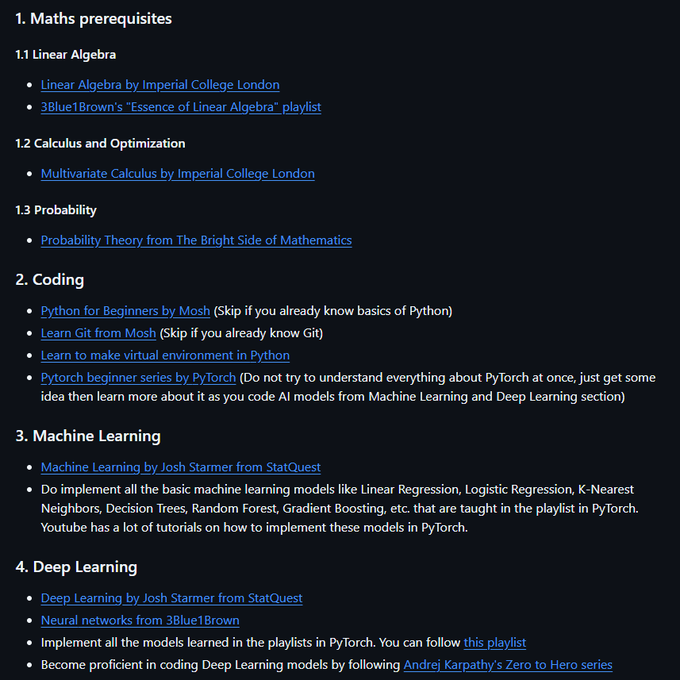

# Starter Syllabus (ML and Neural Networks)

## Python

[#1 Python Tutorial for Beginners | Introduction to Python](https://www.youtube.com/watch?v=hEgO047GxaQ&list=PLsyeobzWxl7poL9JTVyndKe62ieoN-MZ3&index=2&t=0s)

[Practice Python](https://www.practicepython.org/)

[PyLessons](https://pylessons.com/Python-3-basics-tutorial-home)

[Thread by @Sumanth_077 on Thread Reader App](https://threadreaderapp.com/thread/1807415895041753595.html?utm_campaign=topunroll)

[Misc Python Notes](Misc%20Python%20Notes.md)

### Classical ML with Python

[CPSC392](https://www.youtube.com/playlist?list=PLmxpwhh4FDm5zuA_63jV6iiz5wrg76UHV)

[Efficient Python Tricks and Tools for Data Scientists — Effective Python for Data Scientists](https://khuyentran1401.github.io/Efficient_Python_tricks_and_tools_for_data_scientists/README.html)

## Neural Networks

Assignments and Exercises : Up to Exercise 5

[https://github.com/dibgerge/ml-coursera-python-assignments](https://github.com/dibgerge/ml-coursera-python-assignments)

[Lecture 1.1 - What Is Machine Learning - [ Machine Learning | Andrew Ng ]](https://youtu.be/PPLop4L2eGk)

[Lecture 1.2 - Supervised Learning - [ Machine Learning | Andrew Ng ]](https://youtu.be/bQI5uDxrFfA)

[Lecture 6.1 - Logistic Regression | Classification - - [ Machine Learning | Andrew Ng]](https://youtu.be/-la3q9d7AKQ)

[Lecture 6.2 - Logistic Regression | Hypothesis Representation - [ Machine Learning | Andrew Ng]](https://youtu.be/t1IT5hZfS48)

[Lecture 6.3 - Logistic Regression | Decision Boundary - [ Machine Learning | Andrew Ng]](https://youtu.be/F_VG4LNjZZw)

[Lecture 6.4 - Logistic Regression | Cost Function - [ Machine Learning | Andrew Ng]](https://www.youtube.com/watch?v=HIQlmHxI6-0)

[Lecture 6.5 - Logistic Regression | Simplified Cost Function And Gradient Descent - [ Andrew Ng]](https://www.youtube.com/watch?v=TTdcc21Ko9A)

[Lecture 6.6 - Logistic Regression | Advanced Optimization - [ Machine Learning | Andrew Ng]](https://www.youtube.com/watch?v=6vO3DVJlsK4)

[Lecture 6.7 - Logistic Regression | MultiClass Classification OneVsAll - [Andrew Ng]](https://www.youtube.com/watch?v=-EIfb6vFJzc)

[Lecture 7.1 - Regularization | The Problem Of Overfitting - [ Machine Learning | Andrew Ng]](https://www.youtube.com/watch?v=u73PU6Qwl1I)

[Lecture 7.4 - Regularization | Regularized Logistic Regression - [ Machine Learning | Andrew Ng]](https://www.youtube.com/watch?v=IXPgm1e0IOo)

[Lecture 8.1 - Neural Networks Representation | Non Linear Hypotheses - [Andrew Ng]](https://www.youtube.com/watch?v=1ZhtwInuOD0)

[Lecture 8.3 - Neural Networks Representation | Model Representation-I - [ Andrew Ng ]](https://www.youtube.com/watch?v=EVeqrPGfuCY)

[Lecture 8.5 - Neural Networks Representation | Examples And Intuitions-I - [ Andrew Ng]](https://www.youtube.com/watch?v=0a19YIQgRL4)

[Lecture 8.6 - Neural Networks Representation | Examples And Intuitions-II - [ Andrew Ng]](https://www.youtube.com/watch?v=0i9OhkbfNwE)

[Lecture 8.7 - Neural Networks Representation | MultiClass Classification - [Andrew Ng]](https://www.youtube.com/watch?v=gAKQOZ5zIWg)

[Lecture 9.1 - Neural Networks Learning | Cost Function - [ Machine Learning | Andrew Ng]](https://www.youtube.com/watch?v=0twSSFZN9Mc)

[Lecture 9.2 - Neural Networks Learning | Backpropagation Algorithm - [ Machine Learning | Andrew Ng]](https://www.youtube.com/watch?v=x_Eamf8MHwU)

[Lecture 9.3 - Neural Networks Learning | Backpropagation Intuition - [ Machine Learning | Andrew Ng]](https://www.youtube.com/watch?v=mOmkv5SI9hU)

[Lecture 9.6 - Neural Networks Learning | Random Initialization - [ Machine Learning | Andrew Ng]](https://www.youtube.com/watch?v=OF8ocg5mgx0)

[Lecture 9.7 - Neural Networks Learning | Putting It Together - [ Machine Learning | Andrew Ng]](https://www.youtube.com/watch?v=cObOAIImeVQ)

[Lecture 10.3 - Advice For Applying Machine Learning | Model Selection And Train Validation Test Sets](https://www.youtube.com/watch?v=uoTBdCODGvk)

[Introduction to Machine Learning](https://sebastianraschka.com/blog/2021/ml-course.html)

[Introduction to PyTorch - YouTube Series — PyTorch Tutorials 2.6.0+cu124 documentation](https://pytorch.org/tutorials/beginner/introyt/introyt_index.html)

[Google Colab](https://colab.research.google.com/github/pytorch/tutorials/blob/gh-pages/_downloads/af0caf6d7af0dda755f4c9d7af9ccc2c/quickstart_tutorial.ipynb)

[Building Neural Networks from Scratch](https://www.youtube.com/playlist?list=PLPTV0NXA_ZSj6tNyn_UadmUeU3Q3oR-hu)

## cs231n material

Lecture videos 2 to 9 of this playlist : 

[Lecture 1 | Introduction to Convolutional Neural Networks for Visual Recognition](https://www.youtube.com/watch?v=vT1JzLTH4G4&list=PL3FW7Lu3i5JvHM8ljYj-zLfQRF3EO8sYv)

(Convolutional Neural Networks) 

[CS231n Convolutional Neural Networks for Visual Recognition](https://cs231n.github.io/convolutional-networks/)

### fast ai lectures on neural networks

[Lesson 3: Practical Deep Learning for Coders 2022](https://youtu.be/hBBOjCiFcuo)

[Lesson 4: Practical Deep Learning for Coders 2022](https://youtu.be/toUgBQv1BT8)

[Lesson 5: Practical Deep Learning for Coders 2022](https://youtu.be/_rXzeWq4C6w)

## statquest - neural networks

[Neural Networks / Deep Learning](https://www.youtube.com/playlist?list=PLblh5JKOoLUIxGDQs4LFFD--41Vzf-ME1)

## neural networks - zero to hero

[https://www.youtube.com/watch?v=VMj-3S1tku0&list=PLAqhIrjkxbuWI23v9cThsA9GvCAUhRvKZ](https://www.youtube.com/watch?v=VMj-3S1tku0&list=PLAqhIrjkxbuWI23v9cThsA9GvCAUhRvKZ)

https://github.com/MK2112/nn-zero-to-hero-notes

## Deep Learning Fundamentals course

[Deep Learning Fundamentals - Lightning AI](https://lightning.ai/pages/courses/deep-learning-fundamentals/)

[SHALA-2020](https://shala2020.github.io/)

## examples and starter code resources

A toy neural network for regression (numpy, pytorch code)

[Google Colaboratory](https://colab.research.google.com/drive/1fjw_bvVi483iCvdiC_l3odQbD8dTkMr1)

[PyTorch Tutorials](https://www.youtube.com/playlist?list=PLhhyoLH6IjfxeoooqP9rhU3HJIAVAJ3Vz)

[CNN Exercise - Deep Learning for Computer Vision](https://www.kaggle.com/code/mgmarques/cnn-exercise-deep-learning-for-computer-vision)

[Training a Classifier - PyTorch Tutorials 1.13.0+cu117 documentation](https://pytorch.org/tutorials/beginner/blitz/cifar10_tutorial.html)

[PyTorch: Training your first Convolutional Neural Network (CNN) - PyImageSearch](https://pyimagesearch.com/2021/07/19/pytorch-training-your-first-convolutional-neural-network-cnn/)

[Train CNN Model With PyTorch](https://medium.com/thecyphy/train-cnn-model-with-pytorch-21dafb918f48)

[Image Classification using CNNs | Deep Learning with PyTorch (4/6)](https://www.youtube.com/watch?v=EHuACSjijbI)

A simple two-class fine-tuning example with pytorch 

[Transfer Learning for Computer Vision Tutorial - PyTorch Tutorials 1.13.0+cu117 documentation](https://pytorch.org/tutorials/beginner/transfer_learning_tutorial.html)

[Transfer Learning with Convolutional Neural Networks in PyTorch](https://medium.com/towards-data-science/transfer-learning-with-convolutional-neural-networks-in-pytorch-dd09190245ce)

[Implementing CNN in PyTorch with Custom Dataset and Transfer Learning](https://medium.com/analytics-vidhya/implementing-cnn-in-pytorch-with-custom-dataset-and-transfer-learning-1864daac14cc)

Pytorch boilerplate code for some common basic ML tasks:  https://github.com/webstorms/DevTorch

Debugging with pytorch and wandb

[Visualizing and Debugging Neural Networks with PyTorch and Weights & Biases](https://wandb.ai/ayush-thakur/debug-neural-nets/reports/Debugging-Neural-Networks-with-PyTorch-and-W&B--Vmlldzo2OTUzNA)

ML Pitfalls

How to avoid machine learning pitfalls: a guide for academic researchers 

## Advanced material

[A Visual Guide to Learning Rate Schedulers in PyTorch](https://towardsdatascience.com/a-visual-guide-to-learning-rate-schedulers-in-pytorch-24bbb262c863)

[transformers-stuff/warmup_schedulers.ipynb at main · januverma/transformers-stuff](https://github.com/januverma/transformers-stuff/blob/main/warmup_schedulers.ipynb)

https://github.com/raghakot/keras-vis

[AutoGrad from an Engineer’s perspective](https://cismography.medium.com/understanding-autograd-from-scratch-66c2d209c61f)

## Other resources

[Machine Learning](https://www.youtube.com/playlist?list=PLG19vXLQHvSC2ZKFIkgVpI9fCjkN38kwf)

[Animated AI](https://animatedai.github.io/)

[Dataflowr - Deep Learning DIY](https://dataflowr.github.io/website/)

[https://github.com/dataflowr/notebooks](https://github.com/dataflowr/notebooks)

[https://github.com/Vaibhav-Devarasetty/Machine-Learning-Summer-Group-2021](https://github.com/Vaibhav-Devarasetty/Machine-Learning-Summer-Group-2021)

[Pen and Paper Exercises in Machine Learning](https://arxiv.org/abs/2206.13446)

[udlbook](https://udlbook.github.io/udlbook/)

[The Softmax function and its derivative - Eli Bendersky's website](https://eli.thegreenplace.net/2016/the-softmax-function-and-its-derivative/)

[Book: Alice’s Adventures in a differentiable wonderland](https://www.sscardapane.it/alice-book)

Matrix Calculus for Deep Learning : 

[arxiv.org](https://arxiv.org/pdf/1802.01528)

[GitHub - soulmachine/machine-learning-cheat-sheet: Classical equations and diagrams in machine learning](https://github.com/soulmachine/machine-learning-cheat-sheet?tab=readme-ov-file)

[MIT Deep Learning 6.S191](https://introtodeeplearning.com/)

## Deep Dive

[From Scratch - The Convolutional Layer](https://ym2132.github.io/from_scratch_convolutional_layers)

[Making faster | Artificial Inteligence](https://leonardoaraujosantos.gitbook.io/artificial-inteligence/machine_learning/deep_learning/convolution_layer/making_faster)

[PyTorch internals](https://blog.ezyang.com/2019/05/pytorch-internals/)

[How To Train Your PyTorch Models (Much) Faster](https://levelup.gitconnected.com/how-to-train-your-pytorch-models-much-faster-14737c8c9770)

## Books

[https://github.com/letthedataconfess/Deep-Learning-Books](https://github.com/letthedataconfess/Deep-Learning-Books)
