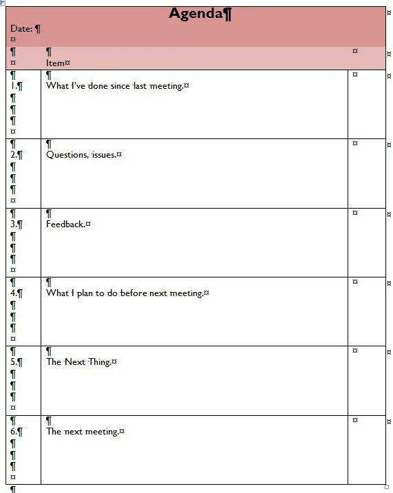

# Group Meeting Advice

- **Prepare slides:** Slides provide structure for our meetings, and they give us artifacts to point at and examine. They also record your research progress for your future reference.
- **Mind the details:** Before the meeting, proofread your slides and sanity check your results in them. At best, errors are distracting. At worst, they introduce misconceptions that take time to correct, or they mislead our research direction.
- **Begin with a list of topics we should discuss:** This helps to budget our time.
- **After the list of topics, review the big picture:** Talk about the research questions you're currently working on and any conclusions from previous meeting. I may have had many meetings since we last met, and a review helps me understand your work. After the big picture, you can show new results.
- **Use time carefully:** 
- **Avoid showing raw output from computational tools:** You should improve the readability of results by creating your own tables and figures. For example, poorly labeled data (e.g., "0" and "1" labels) or excessive digits after decimal points reduce my ability to quickly understand your work.

### Resources
- Jia-Bin Huang’s tips for meetings
  - [https://twitter.com/jbhuang0604/status/1418407079077842944](https://twitter.com/jbhuang0604/status/1418407079077842944)

- **Read these tips** about working with your advisor:
  - [https://github.com/jbhuang0604/awesome-tips/blob/main/working-with-mentor.md](https://github.com/jbhuang0604/awesome-tips/blob/main/working-with-mentor.md)

  - [Principles for Productive Group Meetings](https://bounded-regret.ghost.io/principles-for-productive-group-meetings/)

# How to do experiments?

- [https://twitter.com/jbhuang0604/status/1647098218172252160](https://twitter.com/jbhuang0604/status/1647098218172252160)

## Time Management

- [Calendar. Not to-do lists.](https://deviparikh.medium.com/calendar-in-stead-of-to-do-lists-9ada86a512dd)

# Meeting Outline

