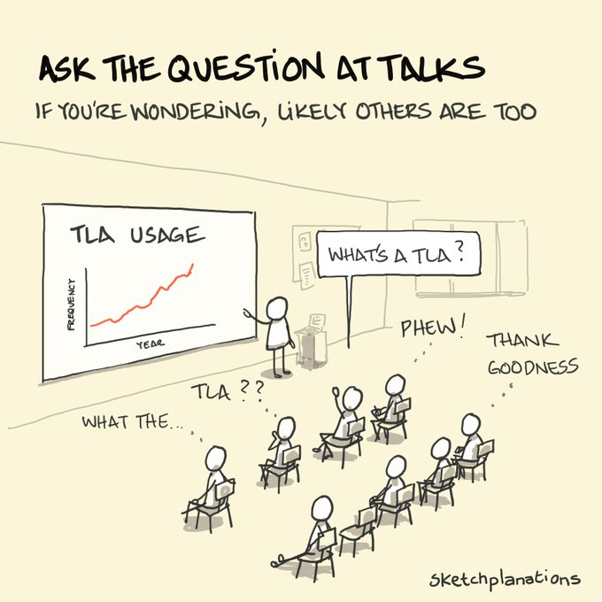

# PhD advice

1. [Eight Lessons Learned in Two Years of Ph.D.](https://ai.engin.umich.edu/2023/08/17/eight-lessons-learned-in-two-years-of-ph-d/)

Starting out

1. [https://youtu.be/SxegvAbFneE?t=797](https://youtu.be/SxegvAbFneE?t=797)

Quality v/s Quantity

1. [https://youtu.be/SxegvAbFneE?t=5122](https://youtu.be/SxegvAbFneE?t=5122)

2. [Written by Witten:  So long, and thanks for all the tips](https://imstat.org/2022/04/01/written-by-witten-so-long-and-thanks-for-all-the-tips/)

