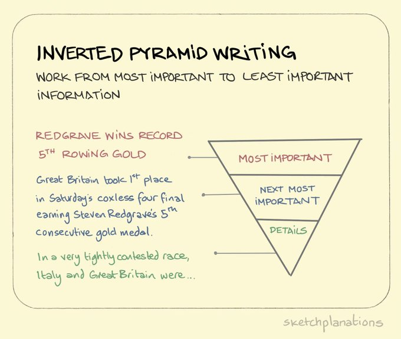
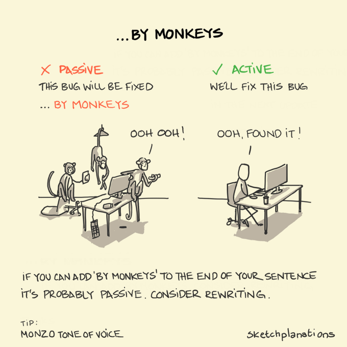

# Writing Advice

[https://www.youtube.com/watch?v=VK51E3gHENc](https://www.youtube.com/watch?v=VK51E3gHENc)

[https://vincentlepetit.github.io/files/paper_writing.pdf](https://vincentlepetit.github.io/files/paper_writing.pdf)

[https://twitter.com/CSProfKGD/status/1497987085344587778](https://twitter.com/CSProfKGD/status/1497987085344587778)

How to write a (ML) paper : 

[https://docs.google.com/document/d/16R1E2ExKUCP5SlXWHr-KzbVDx9DBUclra-EbU8IB-iE/edit](https://docs.google.com/document/d/16R1E2ExKUCP5SlXWHr-KzbVDx9DBUclra-EbU8IB-iE/edit)

[Advice for Authors](https://bounded-regret.ghost.io/advice-for-authors/)

How to write your first research paper : 

[https://poorvucenter.yale.edu/sites/default/files/files/hows_to_write_your_first_research_paper_2011.pdf](https://poorvucenter.yale.edu/sites/default/files/files/hows_to_write_your_first_research_paper_2011.pdf)

[https://twitter.com/SaleemBokhari1/status/1586420517225238529](https://twitter.com/SaleemBokhari1/status/1586420517225238529)

[Writing, part 1 - the process](https://medium.com/@marcotcr/writing-part-1-the-process-6bb92cb522eb)

[https://twitter.com/acagamic/status/1595077200835145730](https://twitter.com/acagamic/status/1595077200835145730)

[https://twitter.com/acagamic/status/1612466764784467969](https://twitter.com/acagamic/status/1612466764784467969)

[https://twitter.com/jbhuang0604/status/1665738070002483201](https://twitter.com/jbhuang0604/status/1665738070002483201)

Planning paper writing 

[Planning paper writing](https://deviparikh.medium.com/planning-paper-writing-553f497e8839)

 

## Robotics Conferences

[Practical Tips for Writing Robotics Conference Papers that Get Accepted](https://michaelmilford.com/practical-tips-for-writing-robotics-conference-papers-that-get-accepted/)

# General/Meta

[https://twitter.com/jbhuang0604/status/1457438411535667201](https://twitter.com/jbhuang0604/status/1457438411535667201)

[https://twitter.com/ericasmyname/status/1612831105580769281](https://twitter.com/ericasmyname/status/1612831105580769281)

Mathematical Writing : 

[Guide for Scholarly Writing](https://shomir.net/scholarly_writing.html)

[https://ethanperez.net/easy-paper-writing-tips/](https://ethanperez.net/easy-paper-writing-tips/)

**How to ML paper :** 

[How to ML Paper - A brief Guide](https://docs.google.com/document/d/16R1E2ExKUCP5SlXWHr-KzbVDx9DBUclra-EbU8IB-iE/edit#heading=h.16t67gkeu9dx)

[Recommendation Larry McEnerney: The Craft of Writing Effectively](https://www.organizingcreativity.com/2022/06/recommendation-larry-mcenerney-the-craft-of-writing-effectively/)

[https://twitter.com/LBacaj/status/1668446029610352641](https://twitter.com/LBacaj/status/1668446029610352641)

# Introduction

[Error Codes for Paper Introductions](https://gameweld.medium.com/error-codes-for-paper-introductions-8deb0d6825c2)

## Misc Writing

Writing a cover letter for a journal : [https://authorservices.taylorandfrancis.com/publishing-your-research/making-your-submission/writing-a-journal-article-cover-letter/](https://authorservices.taylorandfrancis.com/publishing-your-research/making-your-submission/writing-a-journal-article-cover-letter/)

## Misc Quotes and Pictures

**Writing matters.**
Your job as a researcher is not only to create new knowledge, but also to communicate it effectively. You cannot persuade your reader that you have done something important if they cannot figure out what you did or why even you think it is important. Bad writing often accompanies muddled thinking. State theses clearly and precisely and you may be able to see where the gaps are that need to be filled in. If your topic is boring, even transparent writing cannot rescue it. But leaden prose may lead many readers to give up on a paper that, written more clearly and precisely, they might find pretty interesting. Moreover, especially early in your career, the reader is unlikely to have a strong commitment to slogging through your writings. If you make the task loathsome, the reader will simply stop. Make life easy for your reader. Help her to identify simply and precisely the contributions of your paper

