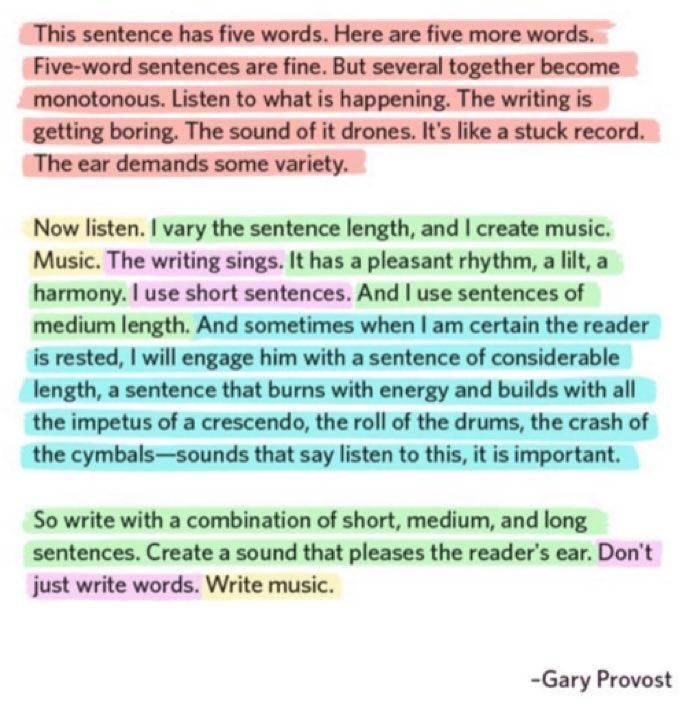
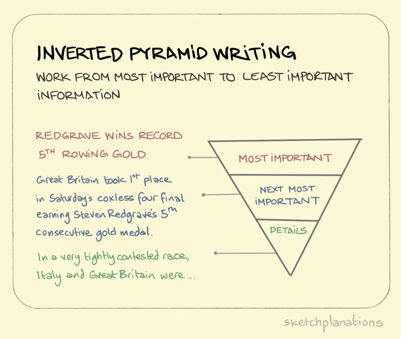
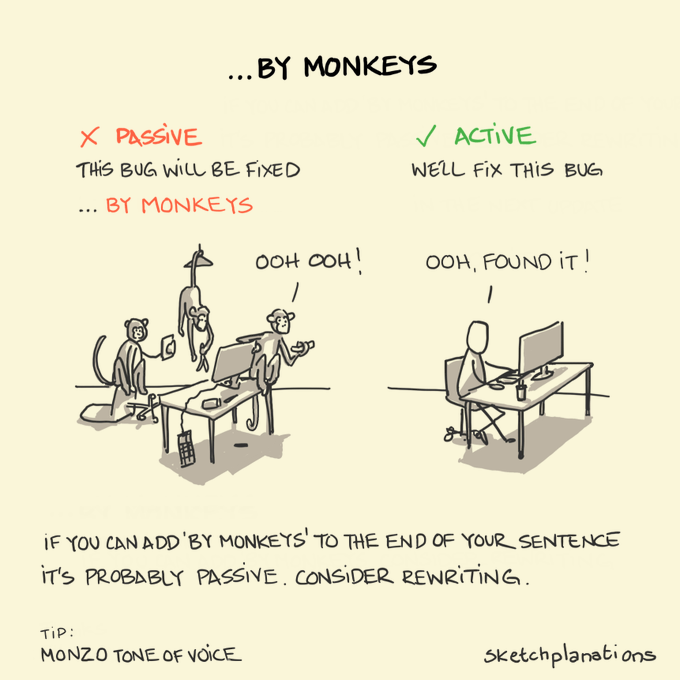

# Writing Advice

1. [https://www.youtube.com/watch?v=VK51E3gHENc](https://www.youtube.com/watch?v=VK51E3gHENc)

2. [https://vincentlepetit.github.io/files/paper_writing.pdf](https://vincentlepetit.github.io/files/paper_writing.pdf)

3. [https://twitter.com/CSProfKGD/status/1497987085344587778](https://twitter.com/CSProfKGD/status/1497987085344587778)

How to write a (ML) paper : 

1. [https://docs.google.com/document/d/16R1E2ExKUCP5SlXWHr-KzbVDx9DBUclra-EbU8IB-iE/edit](https://docs.google.com/document/d/16R1E2ExKUCP5SlXWHr-KzbVDx9DBUclra-EbU8IB-iE/edit)

2. [Advice for Authors](https://bounded-regret.ghost.io/advice-for-authors/)

How to write your first research paper : 

1. [https://poorvucenter.yale.edu/sites/default/files/files/hows_to_write_your_first_research_paper_2011.pdf](https://poorvucenter.yale.edu/sites/default/files/files/hows_to_write_your_first_research_paper_2011.pdf)

2. [https://twitter.com/SaleemBokhari1/status/1586420517225238529](https://twitter.com/SaleemBokhari1/status/1586420517225238529)

3. [Writing, part 1 - the process](https://medium.com/@marcotcr/writing-part-1-the-process-6bb92cb522eb)

4. [https://twitter.com/acagamic/status/1595077200835145730](https://twitter.com/acagamic/status/1595077200835145730)

5. [https://twitter.com/acagamic/status/1612466764784467969](https://twitter.com/acagamic/status/1612466764784467969)

6. [https://twitter.com/jbhuang0604/status/1665738070002483201](https://twitter.com/jbhuang0604/status/1665738070002483201)

Planning paper writing 

1. [Planning paper writing](https://deviparikh.medium.com/planning-paper-writing-553f497e8839)

## Robotics Conferences

1. [Practical Tips for Writing Robotics Conference Papers that Get Accepted](https://michaelmilford.com/practical-tips-for-writing-robotics-conference-papers-that-get-accepted/)

2. [Tokekar writing paper talk](http://tokekar.com/docs/Tokekar-WritingPapers-Talk.pdf)

## General/Meta

1. [https://twitter.com/jbhuang0604/status/1457438411535667201](https://twitter.com/jbhuang0604/status/1457438411535667201)

2. [https://twitter.com/ericasmyname/status/1612831105580769281](https://twitter.com/ericasmyname/status/1612831105580769281)

### Mathematical Writing : 

1. [Reviewing Paper](https://jmlr.csail.mit.edu/reviewing-papers/knuth_mathematical_writing.pdf)

2. [Guide for Scholarly Writing](https://shomir.net/scholarly_writing.html)

3. [https://ethanperez.net/easy-paper-writing-tips/](https://ethanperez.net/easy-paper-writing-tips/)

### How to ML paper :

1. [How to ML Paper - A brief Guide](https://docs.google.com/document/d/16R1E2ExKUCP5SlXWHr-KzbVDx9DBUclra-EbU8IB-iE/edit#heading=h.16t67gkeu9dx)

2. [Recommendation Larry McEnerney: The Craft of Writing Effectively](https://www.organizingcreativity.com/2022/06/recommendation-larry-mcenerney-the-craft-of-writing-effectively/)

3. [https://twitter.com/LBacaj/status/1668446029610352641](https://twitter.com/LBacaj/status/1668446029610352641)

### Introduction

1. [Error Codes for Paper Introductions](https://gameweld.medium.com/error-codes-for-paper-introductions-8deb0d6825c2)

### Misc Writing

1. Writing a cover letter for a journal : [https://authorservices.taylorandfrancis.com/publishing-your-research/making-your-submission/writing-a-journal-article-cover-letter/](https://authorservices.taylorandfrancis.com/publishing-your-research/making-your-submission/writing-a-journal-article-cover-letter/)

### Misc Quotes and Pictures

**Writing matters.**
Your job as a researcher is not only to create new knowledge, but also to communicate it effectively. You cannot persuade your reader that you have done something important if they cannot figure out what you did or why even you think it is important. Bad writing often accompanies muddled thinking. State theses clearly and precisely and you may be able to see where the gaps are that need to be filled in. If your topic is boring, even transparent writing cannot rescue it. But leaden prose may lead many readers to give up on a paper that, written more clearly and precisely, they might find pretty interesting. Moreover, especially early in your career, the reader is unlikely to have a strong commitment to slogging through your writings. If you make the task loathsome, the reader will simply stop. Make life easy for your reader. Help her to identify simply and precisely the contributions of your paper

- [Planning paper writing](https://deviparikh.substack.com/p/planning-paper-writing-553f497e8839)

- [How to ML Paper - A brief Guide](https://docs.google.com/document/d/16R1E2ExKUCP5SlXWHr-KzbVDx9DBUclra-EbU8IB-iE/edit?tab=t.0)

    
How to write a (ML) paper 

    How to ML Paper - A brief Guide
    Feel free to comment / share and happy paper writing! Also, please see caveats* below. 
    If you like this, why not follow How to ML on Twitter and share the advice/love?
    Canonical ML Paper Structure
    Abstract (TL;DR of paper):
    X: What are we trying to do and why is it relevant?
    Y: Why is this hard? 
    Z: How do we solve it (i.e. our contribution!)
    1: How do we verify that we solved it:
    1a) Experiments and results
    1b) Theory 

    Introduction (Longer version of the Abstract, i.e. of the entire paper):
    X: What are we trying to do and why is it relevant?
    Y: Why is this hard? 
    Z: How do we solve it (i.e. our contribution!)
    1: How do we verify that we solved it:
    1a) Experiments and results, including comparison to prior SOTA if applicable
    1b) Theory 
        2: New trend: specifically list your contributions as bullet points (credits to Brendan)
    Extra space? Future work!
    Extra points for having Figure 1 on the first page

    Related Work:
    Academic siblings of our work, i.e. alternative attempts in literature at trying to solve the same problem. 
    Goal is to “Compare and contrast” - how does their approach differ in either assumptions or method? If their method is applicable to our Problem Setting I expect a comparison in the experimental section. If not, there needs to be a clear statement why a given method is not applicable. 
    Note: Just describing what another paper is doing is not enough. We need to compare and contrast.

    Background:
    Academic Ancestors of our work, i.e. all concepts and prior work that are required for understanding our method. 
    Usually includes a subsection, Problem Setting, which formally introduces the problem setting and notation (Formalism) for our method. Highlights any specific assumptions that are made that are unusual. 
    Note: If our paper introduces a novel problem setting as part of its contributions, it’s best to have a separate Section.

    [Problem Setting as separate section – only if the Problem Setting is novel, i.e. a contribution]

    Method:
    What we do. Why we do it. All described using the general Formalism introduced in the Problem Setting and building on top of the concepts / foundations introduced in Background.

    Experimental Setup:
    How do we test that our stuff works? Introduces a specific instantiation of the Problem Setting and specific implementation details of our Method for this Problem Setting. 

    Results and Discussion:
    Shows the results of running Method on our problem described in Experimental Setup. Compares to baselines mentioned in Related Work. Includes statistics and confidence intervals. Includes statements on hyperparameters and other potential issues of fairness. Includes ablation studies to show that specific parts of the method are relevant. Discusses limitations of the method. 

    Conclusion:
    We did it. This paper rocks and you are lucky to have read it (i.e. brief recap of the entire paper). Also, we’ll do all these other amazing things in the future. 
    To keep going with the analogy, you can think of future work as (potential) academic offspring (credits to James).

    Other Advice
    Start with an outline rather than full text. Each line in the outline captures one idea and will correspond to one paragraph in the final version. It is much easier to change the outline of a building before building it. This is a great point in time to have conversations with others if you are unsure. 

    Next, expand the outline, but keep the summary line as Latex comments ahead of every paragraph:

    %TL;DR of paragraph
    Lorem ipsum dolorem… (expansion of the TL;DR), a full paragraph of text that says the TL;DR as easily and clearly as possible. No fluff, not trying to impress, just saying what is and what is not and why think so. Simple, no? 

    This will a) keep you on track and b) make it easy for anyone providing feedback to quickly see what the overall flow is. 

    I recommend writing the Abstract as soon as possible, even before results are finalised. Writing the Abstract first helps sharpen your focus and highlights issues with the paper / method / experiments. Of course you might have to make changes to the writing later, but that's much easier than trying to fix experiments / methods because you realise late that your story doesn't make sense.

    A quick note on author ordering / inclusion, since this keeps coming up:
    Who is an author? 
    My rule of thumb is that anyone who worked on the project for a significant amount of time or contributed something that substantially improved the paper should be included.
    In general, I recommend to err on the side of being generous with including authors. 
    I also recommend to set clear expectations regarding authorship when discussing projects and ideas with potential collaborators (which is usually anyone). 
    Ordering: 
    First author – the person who did the bulk of the work, led the writing effort, often had the initial idea for the method.
    Second author – typically substantial contributions. Usually awarded a * for equal contributions if they worked full time on the paper for a substantial period before the deadline.
    Middle author(s) – broad spectrum! This could be somebody who contributed minor experimental results, someone who was part of the early conversations that led to the project idea or someone who provided usual feedback that materially improved the paper. It’s also a good place for collaborators who worked on the project, but whose results did not make it in the end. 
    Second senior author – this is commonly the post-doc / PhD student that provides day-to-day guidance on the project. 
    Senior author – usually the senior academic who is ultimately responsible for the project (since their name is on the line.. ;)  

    Extremely common writing pitfalls and other advice (print this out and tick off?): 
    Passive voice - unclear why, but this is a very common mistake. Passive gets way overused (e.g. here?). It’s clunky and obfuscates who did what. Avoid it if it can be avoided ;) (see more on this here – credit to Daphne Cornelisse). 
    Be extremely clear on contributions. Never blur the lines between what had been done before and what you did. 
    Be consistent with tense. Avoid switching at all costs, also avoid using future tense if it can be avoided: 
    Eg. “In Section 3 we will show..”
    Avoid filler words at all cost. Think about what you are trying to say and then say it, nothing else. Common filler words are “can”, “In order to”, “shall”  and many others. 
    Example: 
    “The bank loan problem can be reformulated as a special subset of the contextual bandit problem” => 
    “The bank loan problem is a special instance of a contextual bandit problem”
    Once you have written the initial text, try to delete around ⅓ of the words. That’s typically how much “fluff” there is*.
    Put yourself in the shoes of the reader. Is it clear why the current text is relevant and how it fits into the bigger picture? If not, explain. Guide them through the text.
    Please use correct quotation marks in Latex ``correct quotation’’ (copy-paste this if unclear).  You can also use the function \enquote{correct quotation} from the \usepackage{csquotes} which automatically adjusts to the language you're using. 
    Mathematical equations follow standard rules of orthography. Do not forget periods and commas after equations and avoid unnecessary colons. Example:
    ✔ The relationship between the radius and area of a circle is A = r^2 \pi.
    ❌ The relationship between the radius and area of a circle is: A = r^2 \pi.
    Use “\citet” when authors are part of the sentence, e.g. “\citet{foerster2016learnnig} show ..”, and “~\citep” otherwise, e.g “.. recent work~\citep{foerster2016learning}”.
    Use “\𝘶𝘴𝘦𝘱𝘢𝘤𝘬𝘢𝘨𝘦[𝗯𝗮𝗰𝗸𝗿𝗲𝗳=𝗽𝗮𝗴𝗲]{𝘩𝘺𝘱𝘦𝘳𝘳𝘦𝘧}” instead of simply “\𝘶𝘴𝘦𝘱𝘢𝘤𝘬𝘢𝘨𝘦{𝘩𝘺𝘱𝘦𝘳𝘳𝘦𝘧}” to make it easier for a reader to jump to the references and back. (credit to Boris)
    Acronym + citation: “proximal policy optimisation \citep[PPO]{schulman2017ppo}..”.
    Cite any claim that is not supported by your experiments and avoid grandiose language or overly broad claims - it makes it easy to attack the paper for no good reason.
    Cite the correct version of published papers. Google scholar often defaults to the arxiv version, rather than the conference paper. Click “All 10 versions” and choose.
    Check for broken references and citations in the PDF (indicated by ??).
    Don’t leave writing the paper until the last minute. Aim for a complete draft a week before the deadline. 
    Enable change-tracking in Overleaf and share directly with the email addresses of your collaborators. That way it’s in their UI. 
    Introduce terminology that is specific to this work. If it risks being confusing, mention it right next to it "This should not be confused with...", and give an example.
    Avoid synonyms for work-specific terminology at all costs.1 
    Introduce any acronym before using it. The latex packages \usepackage[acronym]{glossaries} (see here) or \usepackage{acronym} can take care of this automatically. Avoid Rrandom Ccapitalisation (RC), even for method names and when introducing acronyms. Only proper nouns are capitalised, for example, Markov chain Monte Carlo (MCMC), partially observed Markov decision process (POMDP), etc.
    The “Transformer” should be capitalised since it’s a proper noun and also changed the field ;) (credits to Albert).
    Introduce only symbols and acronyms that you use in the paper. 
    What is bold and what is italic? Up to you, but be consistent. I tend to use bold to highlight the key message in a paragraph and italic for key words in a sentence.
    Avoid anthropomorphisms (“knowledge” etc) of AI algorithms.
    Avoid subjective claims - usually adjectives are red flags.
    “On the other hand” shouldn’t come without “On the one hand”.
    Avoid repetition of words within a paragraph or sentence (“..that features that are..”).
    Use simple language. Avoid rare words or sounding “fancy’’. For plenty of scientists (like myself) English is not the first language, don’t make life hard for them.
    Footnotes should be after “.” and “,”.1
    If a sentence gets too long and cumbersome, divide into two (credits to Berrin).
    Avoid line breaks / paragraphs that result in lines containing a single (or few) words. It looks 
    lazy.
    Fill the page limit and avoid poor formatting / other whitespace. It looks lazy.

    British or American English? Either is fine but be consistent. ​​Tip: on Overleaf switch "spell check" from "English" to "English (American)" or "English (British)" to make the distinction easier. 
    Never copy-paste from other papers, unless you are verbatim quoting something. It’s much easier (and more ethical!) to write something from scratch than to try to modify something until it looks different. 
    Use the cleveref package for intelligent cross-referencing of figures, tables etc (credits to Sai).

    Last not least - communicate plenty with all authors (i.e. at least daily for the last week) to stay on track and have fun!!

    PS: Nothing here is binding but I think it makes it much easier for everyone if we stick to a basic structure when writing papers. Think of it like a broad convention that allows readers to quickly process papers. 

    PPS: These broad best-practice suggestions are the result of writing papers with a fantastic set of mentors, students and other collaborators - all credits go to them! Special shout-out to my former PhD advisor, Shimon, who inspired many of the points here!

    * Caveats:
    I am sure there are many stylistic subtleties around writing that I am missing in this guide, but winning a literature or poetry competition is definitely not the goal. The goal is to write text that gets complicated content across efficiently. If in doubt just ask yourself if what you wrote is the simplest and clearest way to get the idea across. Also, you don’t need to follow every point religiously. But when you disregard one of these rules, you should be able to explain the motivation behind the rule and why your case is different. E.g., “Passive voice is normally a bad idea since it obscures the subject of the sentence. But in this specific sentence, passive voice was used because the object is the focus of the sentence. Also, the object was mentioned previously, so putting it first lessens the reader’s mental load.” (credits to Roger)

    Comments / questions? Email jakob at robots dot ox dot ac dot uk or comment on Twitter. You can also let me know further common mistakes and I’ll add them here (w/ credit). 

    Licence
    CC BY-NC

